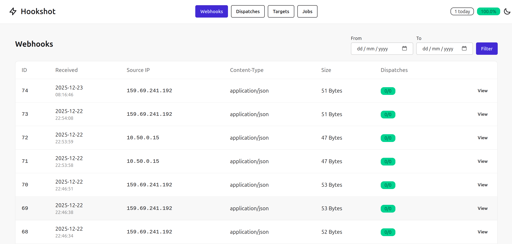

# Hookshot

[](https://github.com/mensfeld/hookshot/actions/workflows/ci.yml)
[](https://github.com/mensfeld/hookshot)

A self-hosted webhook relay service built with Rails 8. Receives webhooks, filters them based on configurable rules, and dispatches to multiple target endpoints.



## Quick Start

```bash
# Clone and install
git clone https://github.com/mensfeld/hookshot.git
cd hookshot
bundle install
npm install

# Setup database and assets
rails db:create db:migrate
rails tailwindcss:build

# Start everything (web + background jobs)
./bin/dev

# Or start separately:
# rails server          # Web server on port 3000
# rails solid_queue:start  # Background job processor
```

Then:
1. Visit `http://localhost:3000/admin/targets` (login: `admin` / `changeme`)
2. Create a target with your destination URL
3. Send webhooks to `http://localhost:3000/webhooks/receive`

## Features

- **Webhook Reception**: Accepts POST requests at `/webhooks/receive` and stores headers, payload, and metadata
- **Multiple Targets**: Configure multiple destination endpoints for webhook delivery
- **Filtering**: Route webhooks to specific targets based on header or payload content
- **Background Processing**: Reliable delivery with Solid Queue, including retries with exponential backoff
- **Admin Dashboard**: View webhooks, dispatches, and manage targets with a clean DaisyUI interface
- **Replay**: Re-dispatch any webhook to all active targets
- **Health Check**: `/health` endpoint for monitoring

## Requirements

- Ruby 3.4+
- SQLite 3
- Node.js (for Tailwind CSS compilation)

## Setup

```bash
# Install dependencies
bundle install
npm install

# Setup database
rails db:create db:migrate

# Compile assets
rails tailwindcss:build

# Start the server
rails server
```

## Configuration

### Environment Variables

| Variable | Default | Description |
|----------|---------|-------------|
| `TZ` | `UTC` | Timezone for displaying timestamps (e.g., `Europe/Warsaw`, `America/New_York`) |
| `HOOKSHOT_USER` | `admin` | HTTP Basic Auth username for admin UI |
| `HOOKSHOT_PASSWORD` | `changeme` | HTTP Basic Auth password for admin UI |
| `RETENTION_DAYS` | `30` | Days to retain webhook data before cleanup |

### Background Jobs

Start Solid Queue to process webhook deliveries:

```bash
rails solid_queue:start
```

Or run everything with Foreman/Overmind using the Procfile.

## Usage

### Receiving Webhooks

Send any POST request to `/webhooks/receive`:

```bash
curl -X POST http://localhost:3000/webhooks/receive \
  -H "Content-Type: application/json" \
  -d '{"event": "user.created", "data": {"id": 123}}'
```

### Admin Dashboard

Access the admin UI at `http://localhost:3000/admin/webhooks` with HTTP Basic Auth.

- **Webhooks**: View received webhooks, inspect headers/payload, replay to targets
- **Dispatches**: Monitor delivery status, retry failed deliveries
- **Targets**: Configure destination endpoints with filters
- **Jobs**: Solid Queue dashboard at `/jobs`

### Configuring Targets

Each target has:

- **Name**: Identifier for the target
- **URL**: Destination endpoint (must be HTTPS in production)
- **Timeout**: Request timeout in seconds (1-300)
- **Active**: Toggle to enable/disable delivery
- **Custom Headers**: Additional headers to send with each request
- **Filters**: Rules to determine which webhooks to deliver

### Filters

Filters allow routing webhooks to specific targets. A target without filters receives every webhook.

**Filter Types:**
- `Header`: Match against request headers
- `Payload`: Match against JSON payload using dot notation (e.g., `$.event`)

**Operators:**
- `Exists`: Field is present
- `Equals`: Field equals exact value
- `Matches (wildcard)`: Whole field matches a pattern with `*` wildcards, ignoring case
- `Matches regex`: Field matches a Ruby regular expression

**Regex details:** the pattern may match anywhere in the value, so anchor it with `\A` and `\z` to match the whole
value. Matching is case-sensitive unless the pattern starts with `(?i)`. A missing field never matches (not even
`.*` or a negative lookahead), and non-string payload values are matched by their string form (`42`, `false`).
Invalid patterns are rejected when saving, and each match is limited to 100ms so a pathological pattern cannot stall
incoming webhooks.

**Example**: deliver comments from Renovate or Dependabot regardless of case:
- Type: `Payload`
- Field: `$.sender.login`
- Operator: `Matches regex`
- Value: `(?i)\A(renovate|dependabot)\[bot\]\z`

**Example**: Only deliver webhooks where `$.event` equals `user.created`:
- Type: `Payload`
- Field: `$.event`
- Operator: `Equals`
- Value: `user.created`

#### Filter Groups

Every filter belongs to a **group** (`default` unless you name one). Groups let a single target express several
alternative conditions:

- **Within a group**, ALL filters must match (AND).
- **Across groups**, ANY fully matching group triggers delivery (OR).

In the target form each group is a card: rename it, add filters to it, or remove it as a whole. Groups can be
collapsed to a one-line summary, and the collapsed state is remembered per target in your browser.

Targets whose filters all stay in the `default` group behave as a plain AND of every filter. Once more groups exist,
`default` is just another alternative: there is no condition shared by all groups, so repeat common checks (such as
a signature header) in every group. A group that only partially matches never causes delivery on its own.

**Example**: forward only actionable GitHub events to one endpoint:

| Group | Type | Field | Operator | Value |
|-------|------|-------|----------|-------|
| `ci-fail` | Header | `X-GitHub-Event` | Equals | `check_suite` |
| `ci-fail` | Payload | `$.check_suite.conclusion` | Equals | `failure` |
| `copilot-comment` | Header | `X-GitHub-Event` | Equals | `issue_comment` |
| `copilot-comment` | Payload | `$.issue.pull_request` | Exists | |
| `copilot-comment` | Payload | `$.comment.user.login` | Matches | `*copilot*` |

This delivers failed check suites and Copilot comments on pull requests, but not a successful check suite
(it only partially matches `ci-fail`) nor comments by other users. Group names are case-sensitive and surrounding
whitespace is stripped.

## API Endpoints

| Method | Path | Auth | Description |
|--------|------|------|-------------|
| POST | `/webhooks/receive` | None | Receive incoming webhooks |
| GET | `/health` | None | Health check endpoint |
| GET | `/admin/*` | Basic | Admin dashboard |
| GET | `/jobs` | Basic | Solid Queue dashboard |

## Delivery Headers

Each delivery includes these headers:

- `Content-Type`: Original webhook content type
- `X-Hookshot-Webhook-Id`: Internal webhook ID
- `X-Hookshot-Delivery-Id`: Internal delivery ID
- Any custom headers configured on the target

## Retry Behavior

Failed deliveries are retried with exponential backoff:

- Up to 5 attempts
- Increasing delay between retries
- Client errors (4xx) are not retried
- Server errors (5xx) and timeouts are retried

## Docker Deployment

Single container runs both web server and background job processor:

```bash
# Build image
docker build -t hookshot .

# Run with docker-compose
SECRET_KEY_BASE=$(rails secret) HOOKSHOT_PASSWORD=your-password docker-compose up -d

# Or run directly
docker run -d \
  -p 3000:3000 \
  -v hookshot_data:/rails/storage \
  -e SECRET_KEY_BASE=$(rails secret) \
  -e HOOKSHOT_PASSWORD=your-password \
  --name hookshot \
  hookshot
```

Data is persisted in the `hookshot_data` volume.

## License

MIT - see [LICENSE.md](LICENSE.md) for details.
